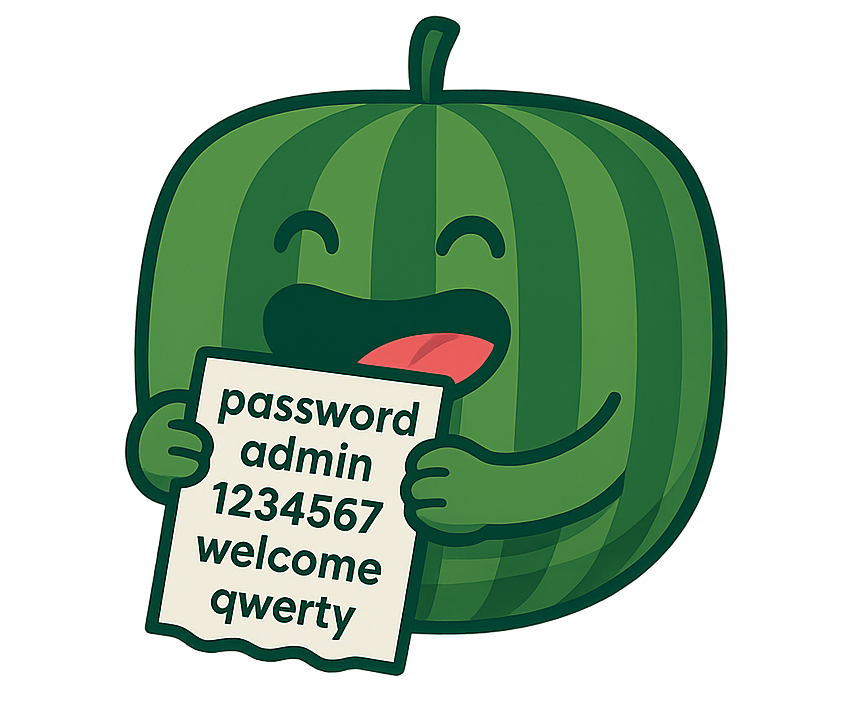
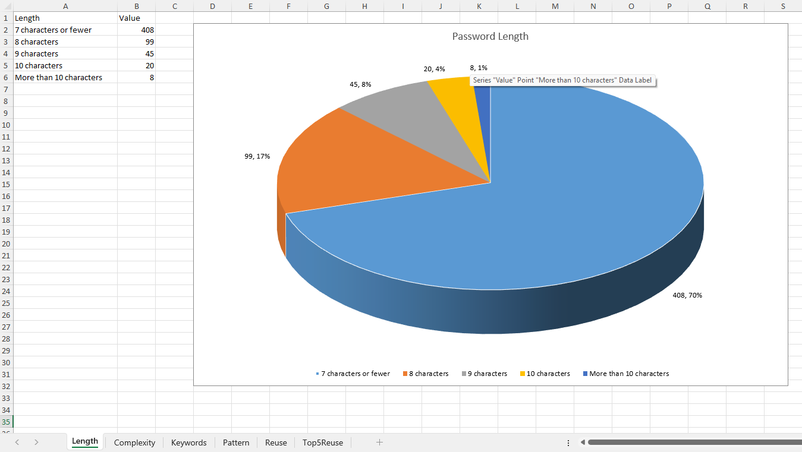
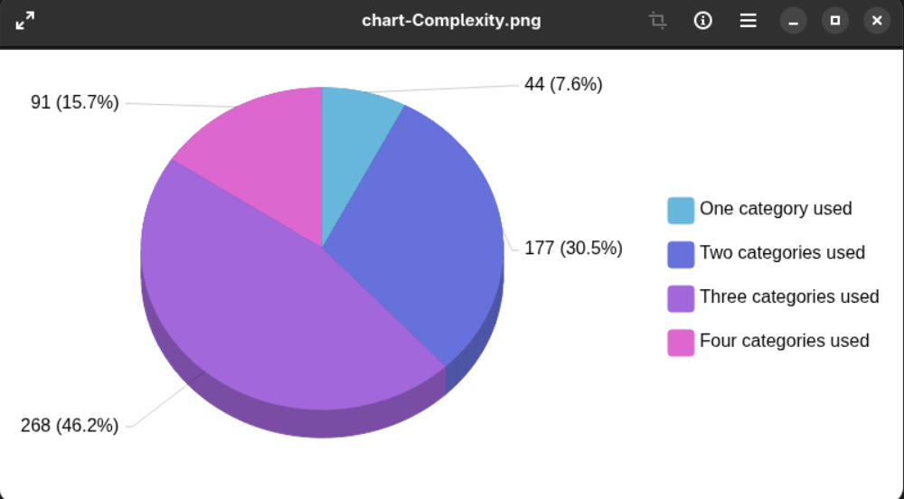
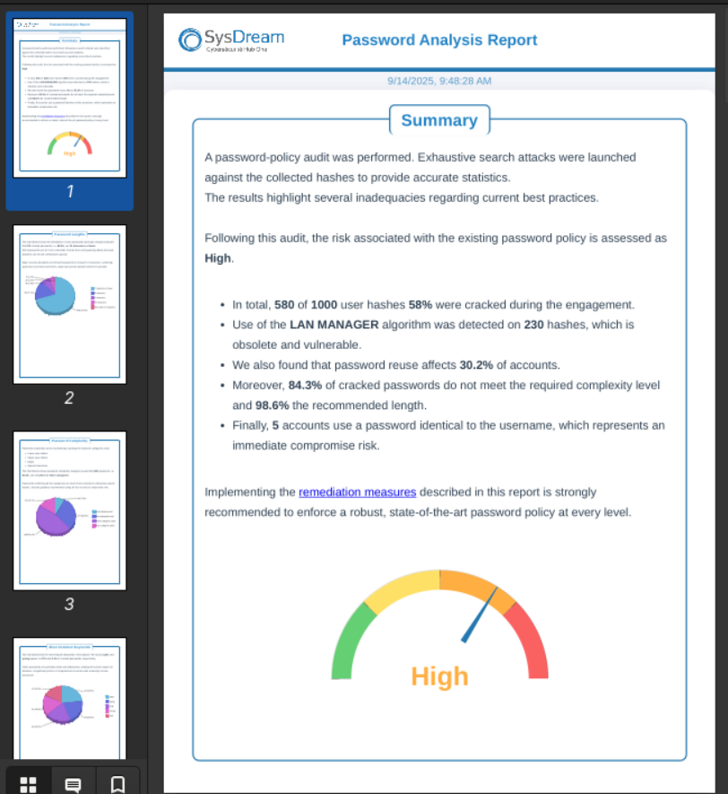

# PassTek
[](https://go.dev/) [](LICENSE)
<p align="center">
  
</p>

**PassTek** is a Go program that analyzes password policy and provides various statistics about it.

## Features

- Passwords stats
  - Lengths
  - Complexity levels
  - Patterns
  - Occurrences
  - Password reuse
  - Usage of LanManager
  - Username as password 

- Visualize data with pie
- Export reports in multiple formats
- Templating and multi-language support

## Input Format

* Password file: one password per line
* Hash file: `username:rid:lmhash:nthash`


## Output Options

The program can output the results in different formats, including:

- HTML report (`.html`): interactive visual charts (via ECharts)
<p align="center">
  
</p>

- Excel spreadsheet (`.xlsx`): organized sheets with stats and charts
<p align="center">
  
</p>

- Screenshot (`.png`): screenshot of all pie charts
<p align="center">
  
</p>
- PDF (`.pdf`): pdf version of the html report
<p align="center">
  
</p>

- Plain text (`.txt`): raw statistics and summaries

      === Hash analysis ===
      Total            : 1000
      Cracked          : 580
      Unique           : 698
      Reuse            : 302
      Lan Manager      : 230
      Empty            : 30
      User as password : 5

      === Password Length ===
      7 characters or fewer   : 408
      8 characters            : 99
      9 characters            : 45
      10 characters           : 20
      More than 10 characters : 8

      === Password Complexity ===
      One category used     : 44
      Two categories used   : 177
      Three categories used : 268
      Four categories used  : 91

      === Most Common Keywords ===
      cyber      : 27
      spring     : 24
      purpl      : 22
      omega      : 21
      pixel      : 21

      === Most Common Patterns === (l = Lowercase, u = Uppercase, d = Digit, s = Special)
      ulllll        : 34
      llllll        : 28
      llllld        : 24
      ullllld       : 21
      ullllll       : 16

      === Most Reused Passwords ===
      cipher        : 8
      @ur0r@#1      : 8
      Purpl35       : 8
      Delta@661     : 8
      0r10n6        : 7

## How to Use

To build:

```bash
git clone https://github.com/sysdream/PassTek.git
cd PassTek
go build cmd/PassTek.go
```

Command example:

```bash
./PassTek -p passwords.txt -H hashes.txt -L logo_sysdream.png -cL logo_client.png -o all -l en
```

## Options

```
  -H string
        Hash file (username:rid:lmhash:nthash:::)
  -L string
        Company logo file (png) (default "img/logo_sysdream.png")
  -anon
        Anonymize passwords (show first 2 and last 2 characters)
  -cL string
        Client logo file (png)
  -f string
        Output types (text, html, excel, screenshot, all) (default "all")
  -l string
        Output language (en,fr) (default "fr")
  -min int
        Minimum number of characters to be considered as an occurrence (default 5)
  -o string
        Output directory (default "output")
  -p string
        Password file (one per line)
  -top int
        Top N entries to display in charts and tables (default 5)
```

## TODO

* Refactor the codebase for better structure and maintainability
* Embed all static and template files for better portability
* Rethink templating on language files (json) to make text editing easier for HTML and PDF reports.

## License

This project is licensed under the [MIT License](LICENSE).

<div align="center">Made with 🍉 by leco</div>
